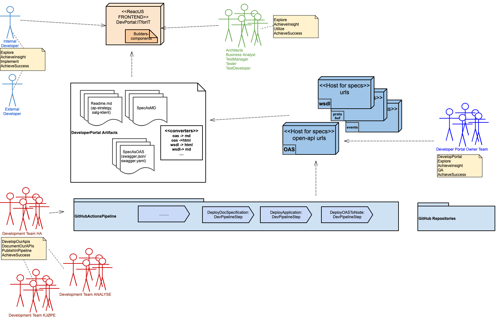
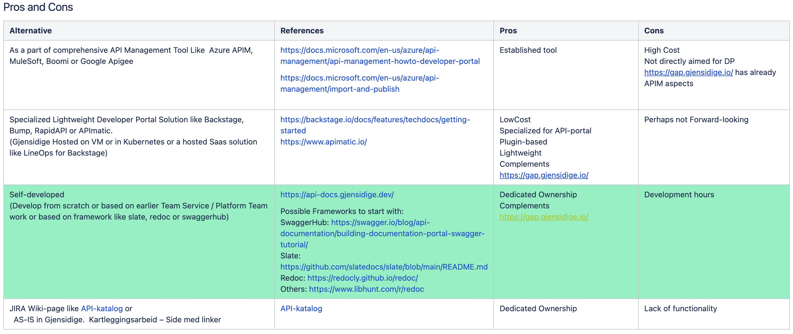

## Useful Knowledge

[Basic markdown knowledge](https://docs.redoc.ly/developer-portal/markdown/).

[API Strategy(github login required)](https://github.com/gjensidige/integration-api-strategy)

## Status for Developer Portal initiative in Gjensidige


[Where are we now ?](./plain.md)


Right now a small  taskforce (Sigurd, Benedictus, Erlend and Njål) is looking into
several possible solutions.

This diagram describes what we want to achieve:





## Alternative Solutions for DP

Several discussions and meetings in the task force ended up with a decision to
go for a self-developed solution based on open-source part of redoc(ly)




## Something to think about

Should we also consider to dynamically look into dynamic documenting diagrams like
Ruter ?

```html
<iframe width="560" height="315" src="https://www.youtube.com/embed/NcEHOlnAY6A" frameborder="0" allow="accelerometer; autoplay; encrypted-media; gyroscope; picture-in-picture" allowfullscreen></iframe>
```


<iframe width="560" height="315" src="https://www.youtube.com/embed/NcEHOlnAY6A" frameborder="0" allow="accelerometer; autoplay; encrypted-media; gyroscope; picture-in-picture" allowfullscreen></iframe>

## Content reuse in Redoc

You can reuse content using the [embed tag](https://redoc.ly/docs/developer-portal/guides/reusing-content/).

## Admonitions

:::warning
Use various [admonitions](https://redoc.ly/docs/developer-portal/markdown/#admonitions) like this warning.
:::

:::info INFO
info
:::

:::success Yee-haw!
success
:::

:::danger
danger
:::

:::attention
attention
:::
